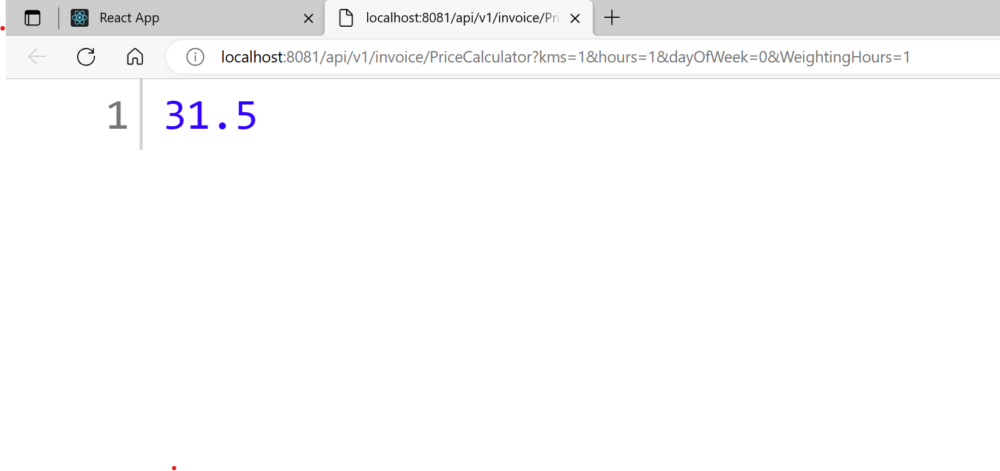

# fn_frontend

<h2>Configuration and billing invoice solution</h2>

Tech stack(frontend) : React.JS, Redux(Frontend Repository: current repository);

Tech stack(Backend) : Java, Spring boot,postgres SQL(backend Reposittory:  fn_backend, database : backup is attached in current repository)

Topics covered : Frontend Demo, Testing outputs, APIS, software configuration for the entire stack

<h3>Frontend Demo</h3>
<h5>Frontend contains 3 pages:</h5>

1.Bill : Billing invoices, fill the kilometers, weighting hours,total ride duration, and configuration type[day: :(:( ]

Based on ride durations TMF(Time Multiplier Factor) and WC(Waiting Charges) will be applied, and DBP(Distance Base Price)
 is applied based on the selected day(Note: please have appropriate DBP configurations)

 

2.Manage Configurations, List of configurations will be displayed in list formats and below operations can be performed<3<3<3

* Configuration can be enabled and disabled(disabled coniguration won't be considered in the calculations

* Delete configuration

* Edit configuration takes to page 3 -> Add Configurations, for further check 3.Add Configurations

 

3.Add Configurations:Configurations can be added and edited in this page 😄

Fields are required as per the configuration your adding, 👽

Note :There are TMF(Time Multiplier Factor),WC(Waiting Charges), DBP(Distance Base Price), and DAP(Distance Additional Price)

Fields are as follow, price, rate, hours, kilometers(Kilometer(km) limit), coniguration type,configuration type[day, 🚸 ]

price : Applicable charge is applied, if the given km limit, and day of the week matches

rate : TMF rate is applied, based on ride duration

hours : ride duration

kilometers : distance on which this configuration is applicable

coniguration type : type of coniguration namely(TMF,DBP, DAP, and WC)

day : day of the week, on which this configuration is applicable for.

 

<h3>---------------------------------------------------------------🚙🚗------------------------------------------------------------</h3>
<h2>Testing outputs</h2>
<h5>Note: below test where carried out with below configuration</h5>
<h3>configurations 🤝</h3>

<h3>Test outputs</h3>

 

  

   

  

<h3>---------------------------------------------------------------🚙🚗------------------------------------------------------------</h3>
<h2>API: Billing api</h2>

Configure the backend application with Java, postgres SQL(default database postgres, with username and password being postgres)

Once the backend is up and running, your will be able to reach the Rest API, https://your-ip:port/api/v1/invoice/PriceCalculator?kms=1&hours=1&dayOfWeek=0&WeightingHours=1

GET Request

parameter : Takes in parameter kms,hours,dayOfWeek, and WeightingHours(similiar to from UI, refer page 1.Bill

Response : response with a string value of amount calculated using formula(from notion page)

<h4>Api Image</h4>

<h2>software configuration</h2>
<h3>Backend: Java jar will be available in the backend repository(.jar file), along with DB backup file</h3>
<h5>* Setup up the database postgres SQL(default database postgres, with username and password being postgres)</h5> 
<h5>* run the .jar file with following command <h6>command -> nohup java -jar filename.jar</h6></h5> 
<h5>* above command will start the backend server, if database setup is done appropriately</h5> 
<h3>frontend : build the frontend with node(npm) or yarn, with below commands</h3>
<h5>* package installation: jump 👨‍⚖️ into the cloned directory of frontend</h5>
<h5>* package installatio command -> npm install</h5>
<h5>* start the frontend server -> npm start</h5>
<h5>* one ultimate thing modify the ip in fetch apis within frontend React application</h5>

<h2>Thanks for reading</h2>

